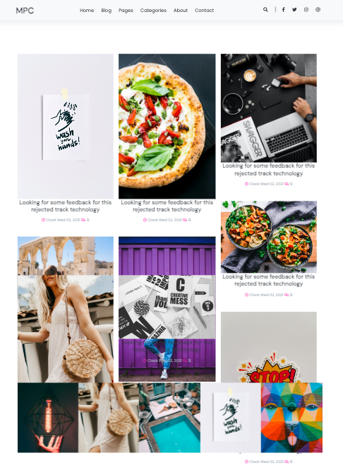
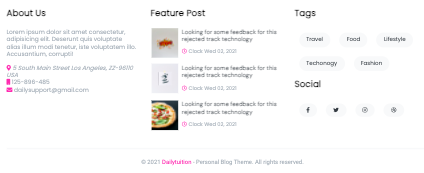

<h3  style="color:#DdD3F3; border:1px solid white">BLOG<span>&nbsp;WITH</span>- <span>&nbsp;</span>DJANGOCMS RUNNING WITH DOCKERS  <span style="color:yellow">&nbsp; using Alpine, Nginx, MySql</span></h3>

<em>[Note]: Please, Start your docker engine</em>

<h3 style="color:#DdD3F3">A - BUILD THE DIFFERENTS SERVICES IMAGES</h3>

```
docker-compose build
```

<h3 style="color:#DdD3F3">B - RUN THE DIFFERENTS CONTAINERS</h3>

```
docker-compose down | docker-compose down -v | docker ps -a | grep django | awk '{print $1}' | xargs docker rm -f  && docker-compose up
```
I prefer the above command because it cleans all before running containers.

```
DJANGOCMS_SU: admin
DJANGO_CMS_PASSWORD: admin 

You have the above informations  inside : my_blog_project/web_env/file.env

```

<h3 style="color:#DdD3F3">C - LANDING PAGE</h3>
<p></p>

<p></p>

<h3 style="color:#DdD3F3">D - USEFULS LINKS</h3>
All thanks to "Daily Tuition channel"  for his design.
<h5><a href="https://www.youtube.com/watch?v=PK_mQwVJxkQ">Click "Daily Tuition channel"</a></h5>

<h5><a href="https://github.com/akashyap2013/Complete_HTML_CSS_Blog_Website/blob/main/sidebar.html">Click "Daily Tuition Github"</a></h5>


